<div align="center">

# 🔐 ZConnect

### Privacy-Preserving Interest Matching on Ethereum

[](LICENSE)
[](https://docs.zama.ai/fhevm)
[](https://hardhat.org/)
[](https://react.dev/)
[](https://sepolia.etherscan.io/)

**Connect with like-minded individuals without revealing your interests to the world.**

[Live Demo](#) • [Documentation](#documentation) • [Report Bug](#support) • [Request Feature](#support)

</div>

---

## 📖 Table of Contents

- [Overview](#overview)
- [The Problem](#the-problem)
- [Our Solution](#our-solution)
- [Key Features](#key-features)
- [How It Works](#how-it-works)
- [Technology Stack](#technology-stack)
- [Architecture](#architecture)
- [Getting Started](#getting-started)
- [Smart Contract](#smart-contract)
- [Frontend Application](#frontend-application)
- [Security & Privacy](#security--privacy)
- [Use Cases](#use-cases)
- [Roadmap](#roadmap)
- [Contributing](#contributing)
- [License](#license)
- [Support](#support)

---

## 🌟 Overview

**ZConnect** is a decentralized application (dApp) that enables users to discover others with shared interests while keeping their preferences completely private. Built on Ethereum using Zama's Fully Homomorphic Encryption (FHE) technology, ZamaConnect allows encrypted on-chain data to be computed without ever being decrypted, ensuring absolute privacy.

Unlike traditional matching platforms where your data is stored in plain text on centralized servers, ZamaConnect encrypts your interests client-side before they ever touch the blockchain. Even the smart contract operators cannot see what you like—only you can decrypt your match results.

---

## 🔴 The Problem

### Privacy Crisis in Modern Social Platforms

1. **Centralized Data Silos**: Traditional platforms store user preferences in plaintext databases, making them vulnerable to:
   - Data breaches and leaks
   - Unauthorized access by employees
   - Government surveillance requests
   - Corporate data mining

2. **Lack of User Control**: Users have no control over:
   - Who can access their data
   - How their data is used
   - When their data is deleted

3. **Blockchain Transparency Trade-off**: While blockchain offers decentralization, it also means:
   - All data is publicly visible
   - Privacy-sensitive information cannot be stored on-chain
   - Users must trust off-chain solutions

4. **No True Privacy in Web3**: Existing Web3 matching/social platforms either:
   - Store data off-chain (defeating the purpose of decentralization)
   - Store encrypted hashes (but require trusted third parties for matching)
   - Expose data publicly on-chain (violating privacy)

---

## ✅ Our Solution

### Fully Homomorphic Encryption Meets Blockchain

ZamaConnect leverages **Zama's FHEVM** (Fully Homomorphic Encryption Virtual Machine) to solve the privacy-transparency paradox:

- ✨ **Encrypted On-Chain Storage**: Your interests are encrypted client-side using FHE and stored on Ethereum
- 🔒 **Private Computation**: Smart contracts compare encrypted preferences without decrypting them
- 🎯 **Personal Decryption**: Only you can decrypt your match results using your wallet's private key
- 🌐 **Fully Decentralized**: No trusted third parties, no centralized servers, no data brokers
- 🔐 **Cryptographically Secure**: Powered by lattice-based cryptography resistant to quantum attacks

### What Makes ZamaConnect Different

| Feature | Traditional Platforms | Blockchain (Plaintext) | ZamaConnect |
|---------|----------------------|------------------------|-------------|
| **Privacy** | ❌ Centralized DB | ❌ Public | ✅ Encrypted |
| **Decentralization** | ❌ Centralized | ✅ Yes | ✅ Yes |
| **On-Chain Computation** | ❌ Off-chain | ⚠️ Limited | ✅ Full FHE |
| **User Control** | ❌ Platform owns data | ⚠️ Public data | ✅ You own keys |
| **Trust Required** | ❌ High | ⚠️ Medium | ✅ Zero |

---

## 🎯 Key Features

### 🔐 Privacy-First Design

- **Client-Side Encryption**: Interests are encrypted in your browser before blockchain submission
- **Zero-Knowledge Matching**: Compare interests without revealing them to anyone, including the contract
- **Selective Disclosure**: You choose when and with whom to share match results

### 🌐 Fully Decentralized

- **On-Chain Logic**: All matching logic runs in smart contracts on Ethereum
- **No Backend Servers**: Pure Web3 architecture with no centralized infrastructure
- **Trustless Operation**: No intermediaries can access your data

### 🎨 Modern User Experience

- **Intuitive Interface**: Beautiful glassmorphism design with smooth animations
- **Web3 Wallet Integration**: Seamless connection via RainbowKit (MetaMask, WalletConnect, etc.)
- **Responsive Design**: Works flawlessly on desktop, tablet, and mobile devices
- **Real-Time Updates**: Live feedback on blockchain transactions and matching status

### 🚀 Powered by Cutting-Edge Technology

- **Zama FHE**: State-of-the-art fully homomorphic encryption
- **Ethereum Blockchain**: Secure, battle-tested decentralized infrastructure
- **React 19**: Latest React features for optimal performance
- **TypeScript**: Type-safe development for reliability

---

## ⚙️ How It Works

### User Journey

```mermaid
graph TD
    A[Connect Wallet] --> B[Select 3 Interests]
    B --> C[Client-Side FHE Encryption]
    C --> D[Submit to Smart Contract]
    D --> E[Stored Encrypted On-Chain]
    E --> F[Browse Other Users]
    F --> G[Request Match Comparison]
    G --> H[Smart Contract Compares Encrypted Data]
    H --> I[Encrypted Result Returned]
    I --> J[Client-Side Decryption]
    J --> K{Match Found?}
    K -->|Yes| L[Display Positive Match ✓]
    K -->|No| M[Display No Match ✗]
```



### Step-by-Step Process

1. **Wallet Connection**
   - User connects their Ethereum wallet (MetaMask, WalletConnect, etc.)
   - Application initializes Zama FHE instance in the browser

2. **Interest Selection**
   - User selects their top 3 interests from 10 available categories:
     - AI Research
     - Climate Tech
     - Web3 Infrastructure
     - Indie Game Design
     - Digital Art & NFTs
     - Music Production
     - Space Exploration
     - Sustainable Fashion
     - Robotics
     - Gourmet Science

3. **Encryption & Submission**
   - Selected interests (represented as numbers 1-10) are encrypted using Zama FHE
   - Encrypted values + cryptographic proof are submitted to the `InterestMatcher` smart contract
   - Transaction is signed and broadcast to Ethereum Sepolia testnet

4. **On-Chain Storage**
   - Smart contract stores encrypted preferences in a mapping
   - User's address is added to the registry of participants
   - `PreferencesRegistered` event is emitted

5. **Finding Matches**
   - User browses the list of registered participants
   - Selects a candidate to compare interests with
   - Initiates a match request transaction

6. **Encrypted Comparison**
   - Smart contract performs FHE operations to compare all 9 combinations (3×3):
     - Does your 1st choice match their 1st, 2nd, or 3rd?
     - Does your 2nd choice match their 1st, 2nd, or 3rd?
     - Does your 3rd choice match their 1st, 2nd, or 3rd?
   - Result is an encrypted boolean: `1` (match found) or `0` (no match)
   - Encrypted result is stored and accessible only to the requester

7. **Private Decryption**
   - User retrieves their encrypted match result
   - Zama Relayer service decrypts the result using user's wallet signature
   - Frontend displays whether interests overlap—without revealing which specific interests matched

---

## 🛠️ Technology Stack

### Smart Contracts

| Technology | Version | Purpose |
|------------|---------|---------|
| **Solidity** | 0.8.27 | Smart contract language |
| **Zama FHEVM** | 0.8.0 | Fully Homomorphic Encryption library |
| **Hardhat** | 2.26.0 | Development environment & testing |
| **OpenZeppelin** | - | Secure contract patterns |
| **Ethers.js** | 6.15.0 | Ethereum interaction library |

### Frontend

| Technology | Version | Purpose |
|------------|---------|---------|
| **React** | 19.1.1 | UI framework |
| **TypeScript** | 5.8.3 | Type safety |
| **Vite** | 7.1.6 | Build tool & dev server |
| **Wagmi** | 2.17.0 | React hooks for Ethereum |
| **RainbowKit** | 2.2.8 | Wallet connection UI |
| **React Query** | 5.89.0 | Server state management |
| **Viem** | 2.37.6 | Low-level Ethereum library |
| **Zama Relayer SDK** | 0.2.0 | FHE encryption/decryption |

### Infrastructure

- **Blockchain**: Ethereum Sepolia Testnet
- **Node Provider**: Infura
- **Deployment**: Netlify (Frontend) / Hardhat Deploy (Contracts)
- **Version Control**: Git

---

## 🏗️ Architecture

### System Architecture

```
┌─────────────────────────────────────────────────────────────┐
│                         Frontend (React)                      │
│  ┌────────────┐  ┌─────────────┐  ┌────────────────────┐    │
│  │ Preference │  │   Match     │  │   Wallet Connect   │    │
│  │   Setup    │  │  Explorer   │  │   (RainbowKit)     │    │
│  └────────────┘  └─────────────┘  └────────────────────┘    │
│         │                │                    │               │
│         └────────────────┴────────────────────┘               │
│                          │                                    │
│                    Zama FHE SDK                               │
│                          │                                    │
└──────────────────────────┼────────────────────────────────────┘
                           │
                    Ethereum Network
                           │
┌──────────────────────────┼────────────────────────────────────┐
│                   Smart Contract Layer                         │
│                                                                │
│  ┌──────────────────────────────────────────────────────┐    │
│  │         InterestMatcher.sol (FHEVM)                  │    │
│  │                                                       │    │
│  │  • submitPreferences(encrypted interests, proof)     │    │
│  │  • requestMatch(candidate address)                   │    │
│  │  • getEncryptedMatch(seeker, candidate)              │    │
│  │  • getRegisteredPlayers()                            │    │
│  │  • hasPreferences(player)                            │    │
│  │                                                       │    │
│  │  Storage:                                             │    │
│  │  • _preferences: address => PlayerPreferences        │    │
│  │  • _matchResults: address => address => euint32     │    │
│  │  • _players: address[]                               │    │
│  └──────────────────────────────────────────────────────┘    │
│                                                                │
└────────────────────────────────────────────────────────────────┘
                           │
                    Zama FHE Network
                           │
                   ┌───────────────┐
                   │ Relayer Service│
                   │  (Decryption)  │
                   └───────────────┘
```

### Smart Contract Data Structures

```solidity
struct PlayerPreferences {
    euint32 first;      // Encrypted 1st choice (1-10)
    euint32 second;     // Encrypted 2nd choice (1-10)
    euint32 third;      // Encrypted 3rd choice (1-10)
    bool registered;    // Has user submitted preferences?
    uint64 updatedAt;   // Last update timestamp
}
```

### Encryption Flow

```
Plain Interest ID (1-10)
         │
         ▼
┌─────────────────────┐
│  Zama FHE Encrypt   │  ← User's browser
└─────────────────────┘
         │
         ▼
    externalEuint32 + Proof
         │
         ▼
┌─────────────────────┐
│ Smart Contract      │  ← Ethereum blockchain
│ FHE.fromExternal()  │
└─────────────────────┘
         │
         ▼
      euint32 (stored encrypted)
         │
         ▼
┌─────────────────────┐
│ FHE Operations      │  ← Comparison without decryption
│ (eq, or, select)    │
└─────────────────────┘
         │
         ▼
   euint32 result (0 or 1)
         │
         ▼
┌─────────────────────┐
│ Zama Relayer        │  ← Decryption service
│ (user signature)    │
└─────────────────────┘
         │
         ▼
    Plain result (Match/No Match)
```

---

## 🚀 Getting Started

### Prerequisites

Before you begin, ensure you have the following installed:

- **Node.js**: Version 20 or higher
- **npm**: Version 7.0.0 or higher
- **Git**: For version control
- **MetaMask**: Or another Web3 wallet browser extension

### Installation

#### 1. Clone the Repository

```bash
git clone https://github.com/yourusername/ZamaConnect.git
cd ZamaConnect
```

#### 2. Install Dependencies

**Install root dependencies (Hardhat/Smart Contracts):**

```bash
npm install
```

**Install frontend dependencies:**

```bash
cd src
npm install
cd ..
```

#### 3. Environment Configuration

**Set up Hardhat environment variables:**

```bash
# Mnemonic for wallet deployment
npx hardhat vars set MNEMONIC

# Infura API key for Sepolia network
npx hardhat vars set INFURA_API_KEY

# (Optional) Etherscan API key for contract verification
npx hardhat vars set ETHERSCAN_API_KEY
```

**Set up frontend environment variables:**

Create `src/.env` file:

```env
# WalletConnect Project ID (get from https://cloud.walletconnect.com)
VITE_WALLETCONNECT_PROJECT_ID=your_project_id_here

# Contract address (leave blank to use default)
# VITE_INTEREST_MATCHER_ADDRESS=0xYourContractAddress
```

#### 4. Compile Smart Contracts

```bash
npm run compile
```

#### 5. Run Tests

```bash
# Local network tests
npm run test

# Test on Sepolia (requires deployment)
npm run test:sepolia
```

### Running the Application

#### Option A: Local Development (Recommended for Testing)

**Start local Hardhat node:**

```bash
npm run chain
```

**Deploy contracts to local network (in a new terminal):**

```bash
npm run deploy:localhost
```

**Start frontend development server:**

```bash
cd src
npm run dev
```

Open [http://localhost:5173](http://localhost:5173) in your browser.

#### Option B: Use Deployed Sepolia Contract

The project is already deployed on Sepolia testnet at:
- **Contract Address**: `0xc1a6ef590d885830a2FE1e67dF1f9119018CBe4B`
- **Network**: Sepolia
- **Explorer**: [View on Etherscan](https://sepolia.etherscan.io/address/0xc1a6ef590d885830a2FE1e67dF1f9119018CBe4B)

**Just start the frontend:**

```bash
cd src
npm run dev
```

Make sure your wallet is connected to Sepolia testnet and has test ETH.

### Getting Test ETH

To interact with the application on Sepolia, you'll need test ETH:

- [Sepolia Faucet 1](https://sepoliafaucet.com/)
- [Sepolia Faucet 2](https://www.alchemy.com/faucets/ethereum-sepolia)
- [Sepolia Faucet 3](https://faucet.quicknode.com/ethereum/sepolia)

---

## 📜 Smart Contract

### Contract: `InterestMatcher.sol`

**Deployed on Sepolia**: `0xc1a6ef590d885830a2FE1e67dF1f9119018CBe4B`

### Core Functions

#### `submitPreferences()`

Encrypts and stores user's top 3 interests on-chain.

```solidity
function submitPreferences(
    externalEuint32 interestOne,
    externalEuint32 interestTwo,
    externalEuint32 interestThree,
    bytes calldata inputProof
) external
```

**Parameters:**
- `interestOne`: Encrypted 1st choice (1-10)
- `interestTwo`: Encrypted 2nd choice (1-10)
- `interestThree`: Encrypted 3rd choice (1-10)
- `inputProof`: Cryptographic proof for encrypted inputs

**Emits:** `PreferencesRegistered(address player, uint64 timestamp)`

#### `requestMatch()`

Compares caller's interests with candidate's interests, stores encrypted result.

```solidity
function requestMatch(address candidate) external
```

**Parameters:**
- `candidate`: Address of user to compare with

**Requirements:**
- Caller must have submitted preferences
- Candidate must have submitted preferences
- Cannot match with self

**Emits:** `MatchComputed(address seeker, address candidate)`

#### `getEncryptedMatch()`

Retrieves encrypted match result.

```solidity
function getEncryptedMatch(
    address seeker,
    address candidate
) external view returns (euint32)
```

**Returns:** Encrypted uint32 (1 = match, 0 = no match)

#### `getRegisteredPlayers()`

Returns all users who have submitted preferences.

```solidity
function getRegisteredPlayers() external view returns (address[] memory)
```

**Returns:** Array of user addresses

#### `hasPreferences()`

Checks if a user has submitted preferences.

```solidity
function hasPreferences(address player) external view returns (bool)
```

**Returns:** `true` if user has preferences, `false` otherwise

### FHE Operations Used

The contract uses Zama's FHE library for:

- **`FHE.fromExternal()`**: Convert external encrypted value to on-chain encrypted value
- **`FHE.eq()`**: Compare two encrypted values for equality
- **`FHE.or()`**: Logical OR on encrypted booleans
- **`FHE.select()`**: Conditional selection based on encrypted boolean
- **`FHE.allow()`**: Grant decryption permission to addresses
- **`FHE.asEuint32()`**: Convert plaintext to encrypted uint32
- **`FHE.asEbool()`**: Convert plaintext to encrypted boolean

### Deployment

**Deploy to Sepolia:**

```bash
npm run deploy:sepolia
```

**Verify on Etherscan:**

```bash
npx hardhat verify --network sepolia <CONTRACT_ADDRESS>
```

---

## 🎨 Frontend Application

### Project Structure

```
src/
├── src/
│   ├── components/          # React components
│   │   ├── Header.tsx           # App header with wallet connect
│   │   ├── InterestApp.tsx      # Main app container & tabs
│   │   ├── PreferenceSetup.tsx  # Interest selection & submission
│   │   └── MatchExplorer.tsx    # User browsing & matching
│   ├── config/              # Configuration files
│   │   ├── wagmi.ts             # Wagmi/wallet configuration
│   │   └── contracts.ts         # Contract ABI & address
│   ├── hooks/               # Custom React hooks
│   │   ├── useZamaInstance.ts   # FHE instance management
│   │   └── useEthersSigner.ts   # Wagmi to Ethers signer conversion
│   ├── styles/              # CSS modules
│   │   ├── Header.css
│   │   ├── InterestApp.css
│   │   ├── PreferenceSetup.css
│   │   └── MatchExplorer.css
│   ├── App.tsx              # Root component
│   ├── main.tsx             # React entry point
│   └── index.css            # Global styles
├── index.html               # HTML entry point
├── vite.config.ts           # Vite configuration
└── package.json             # Dependencies
```

### Key Components

#### `PreferenceSetup.tsx`

**Purpose**: Select and submit encrypted interests

**Features**:
- 10 interest cards in responsive grid
- Visual selection feedback with ranking
- Client-side FHE encryption
- Transaction status tracking
- Error handling & validation

**User Flow**:
1. Select exactly 3 interests (in order)
2. Click "Save My Preferences"
3. Wait for encryption (Zama FHE)
4. Confirm transaction in wallet
5. See success message & on-chain status

#### `MatchExplorer.tsx`

**Purpose**: Browse users and find matches

**Features**:
- List all registered participants
- One-click match request
- Encrypted result decryption
- Visual match indicators
- Wallet connection checks

**User Flow**:
1. Browse candidate cards
2. Click "Check Match" on a user
3. Transaction broadcasts encrypted comparison
4. Retrieve & decrypt result
5. See match status (✓ or ✗)

#### `Header.tsx`

**Purpose**: App branding and wallet connection

**Features**:
- Glassmorphism design
- RainbowKit wallet button
- Sticky header
- Responsive layout

### Custom Hooks

#### `useZamaInstance`

Initializes and manages Zama FHE encryption instance.

```typescript
const { instance, isLoading, error } = useZamaInstance();
```

**Returns**:
- `instance`: Zama FHE instance (or `null` if loading/error)
- `isLoading`: Boolean loading state
- `error`: Error message (if any)

#### `useEthersSigner`

Converts Wagmi wallet signer to Ethers.js signer.

```typescript
const signer = useEthersSigner({ chainId });
```

**Why?**: Zama SDK requires Ethers.js signer, but Wagmi uses Viem

### Styling

**Design System**:
- **Glassmorphism**: Frosted glass effect with backdrop blur
- **Gradient Backgrounds**: Purple gradient mesh (#667eea to #764ba2)
- **Smooth Animations**: Cubic-bezier transitions
- **Responsive**: Mobile-first with breakpoints at 640px and 768px

**Color Palette**:
- Primary: `#6366f1` (Indigo)
- Secondary: `#8b5cf6` (Purple)
- Accent: `#ec4899` (Pink)
- Background: Gradient purple mesh
- Cards: `rgba(255, 255, 255, 0.95)` with backdrop blur

### Building for Production

```bash
cd src
npm run build
```

Output directory: `src/dist/`

**Deploy to Netlify/Vercel:**

1. Connect your Git repository
2. Set build command: `cd src && npm run build`
3. Set publish directory: `src/dist`
4. Add environment variables in hosting dashboard

---

## 🔒 Security & Privacy

### Privacy Guarantees

✅ **What's Private**:
- Your specific interest selections (stored encrypted on-chain)
- Which interests matched with a candidate (only you can decrypt)
- The existence of matches before you decrypt them

✅ **What's Public**:
- Your wallet address
- The fact that you've submitted preferences (but not what they are)
- Timestamps of your interactions
- Who you've requested matches with

### Cryptographic Security

**Encryption Algorithm**: Lattice-based FHE (Zama's implementation)

**Key Properties**:
- **Post-Quantum Secure**: Resistant to quantum computer attacks
- **Homomorphic**: Operations on encrypted data without decryption
- **Deterministic**: Same input always produces same encrypted output (for comparison)

**Attack Resistance**:
- ✅ Brute force: Computationally infeasible (256-bit security)
- ✅ Man-in-the-middle: Ethereum's consensus prevents tampering
- ✅ Replay attacks: Nonce-based transaction ordering
- ✅ Smart contract bugs: Audited FHE library from Zama

### Known Limitations

⚠️ **Metadata Leakage**:
- Transaction patterns visible on-chain (e.g., who you match with)
- Gas usage may leak information about computational paths

⚠️ **Relayer Trust**:
- Decryption requires Zama Relayer service
- User must sign decryption request (proves ownership)
- Alternative: Run your own relayer for full trustlessness

⚠️ **Small Input Space**:
- Only 10 interests means brute-force is theoretically possible
- Mitigation: Encrypted comparisons hide which specific interest matched

### Best Practices for Users

1. **Use a dedicated wallet**: Don't reuse your main wallet for privacy
2. **Be selective**: Don't match with everyone (reduces metadata leakage)
3. **Understand trade-offs**: Blockchain is pseudonymous, not anonymous
4. **Trust assumptions**: You trust Ethereum consensus and Zama's FHE implementation

---

## 💡 Use Cases

### 1. Professional Networking

**Scenario**: Finding collaborators with shared expertise

**Example**:
- Alice works in AI Research and Climate Tech
- Bob works in AI Research and Web3
- They discover they both love AI without revealing their other interests
- They connect to discuss potential AI collaboration

**Benefits**:
- No LinkedIn-style public profile required
- Employers can't see your side interests
- Explore career pivots privately

### 2. Social Meetups

**Scenario**: Organizing interest-based gatherings

**Example**:
- A DAO uses ZamaConnect to match members for local meetups
- Members select hobbies/interests anonymously
- Only matched pairs/groups are revealed
- Organizers can't see individual preferences

**Benefits**:
- Privacy-preserving community building
- Avoid filter bubbles of public profiles
- Genuine interest-based connections

### 3. Dating & Relationships

**Scenario**: Finding compatible partners based on interests

**Example**:
- Users select lifestyle/hobby interests
- Only mutual matches are revealed
- No public profile to attract unwanted attention

**Benefits**:
- More privacy than traditional dating apps
- No centralized company selling your data
- Encrypted preference storage

### 4. Education & Study Groups

**Scenario**: Forming study groups by subject interest

**Example**:
- Students encrypt their favorite subjects
- Find peers with overlapping academic interests
- Form study groups without revealing full course load

**Benefits**:
- Academic privacy (competitive environments)
- Cross-program collaboration
- Safe exploration of new subjects

### 5. Hiring & Recruitment

**Scenario**: Anonymous skill/interest matching

**Example**:
- Job seekers encrypt their skill interests
- Companies encrypt required skills
- Matches revealed without exposing full profiles
- Reduces bias in initial screening

**Benefits**:
- Blind recruitment process
- Skill-first matching
- Privacy until mutual interest

### 6. Web3 Communities

**Scenario**: DAO contributor matching

**Example**:
- DAO members encrypt their contribution interests
- Find others working on similar initiatives
- Form working groups based on encrypted overlaps

**Benefits**:
- Decentralized coordination
- Privacy in competitive governance
- Permissionless collaboration

---

## 🗺️ Roadmap

### ✅ Phase 1: MVP (Current)

- [x] Smart contract with FHE encryption
- [x] Basic interest matching (3 out of 10 interests)
- [x] React frontend with wallet integration
- [x] Sepolia testnet deployment
- [x] Glassmorphism UI design

### 🚧 Phase 2: Enhanced Matching (Q2 2025)

- [ ] **Advanced Matching Algorithms**:
  - Weight interests by priority (1st choice = 3 points, 2nd = 2 points, 3rd = 1 point)
  - Return match score (0-9) instead of binary yes/no
  - Threshold-based matching (e.g., "notify me if score > 5")

- [ ] **User Profiles**:
  - Optional public bio/avatar (IPFS storage)
  - Reputation system (on-chain reviews)
  - Activity badges

- [ ] **Category Expansion**:
  - 50+ interest categories
  - Hierarchical categories (e.g., "Music" → "Jazz", "Rock", "Electronic")
  - Custom category creation (user-generated)

### 🔮 Phase 3: Advanced Privacy (Q3 2025)

- [ ] **Zero-Knowledge Proofs**:
  - Prove you have N matches without revealing who
  - Prove interest overlap exists without initiating match
  - Anonymous match requests via ZK-SNARKs

- [ ] **Enhanced Decryption**:
  - Self-hosted relayer option (full trustlessness)
  - Multi-party computation for shared decryption
  - Time-locked decryption (reveal after deadline)

- [ ] **Privacy Improvements**:
  - Tor/VPN integration recommendations
  - Wallet anonymization guides
  - Metadata obfuscation techniques

### 🌐 Phase 4: Ecosystem (Q4 2025)

- [ ] **Multi-Chain Support**:
  - Deploy to Ethereum mainnet
  - Polygon, Arbitrum, Optimism integrations
  - Cross-chain matching (bridge encrypted data)

- [ ] **Social Features**:
  - Encrypted messaging (on-chain or IPFS)
  - Group matching (3+ way overlaps)
  - Event creation for matched groups

- [ ] **Developer Tools**:
  - SDK for integrating ZamaConnect into dApps
  - Embeddable widget for websites
  - API for programmatic access

### 🚀 Phase 5: Mainnet & Scale (2026)

- [ ] **Production Deployment**:
  - Ethereum mainnet launch
  - Professional security audit
  - Bug bounty program

- [ ] **Governance**:
  - DAO for protocol upgrades
  - Community-driven feature voting
  - Interest category curation

- [ ] **Monetization** (Optional):
  - Premium features (advanced matching, analytics)
  - DAO treasury for sustainability
  - Grant programs for developers

### 🔬 Research Directions

- [ ] **FHE Optimizations**:
  - Reduce gas costs via batch operations
  - Explore FHE hardware acceleration
  - Investigate FHE-friendly ML models

- [ ] **Formal Verification**:
  - Mathematical proof of privacy guarantees
  - Smart contract formal verification
  - Security audit by external firms

- [ ] **Interoperability**:
  - Integration with existing social graphs (Lens, Farcaster)
  - ENS/UD domain support
  - DID (Decentralized Identity) compatibility

---

## 🤝 Contributing

We welcome contributions from the community! Whether you're a developer, designer, or privacy enthusiast, there's a place for you.

### How to Contribute

1. **Fork the repository**
2. **Create a feature branch**: `git checkout -b feature/amazing-feature`
3. **Commit your changes**: `git commit -m 'Add amazing feature'`
4. **Push to the branch**: `git push origin feature/amazing-feature`
5. **Open a Pull Request**

### Development Guidelines

- **Code Style**: Follow existing TypeScript/Solidity conventions
- **Testing**: Add tests for new features
- **Documentation**: Update README and inline comments
- **Commits**: Use clear, descriptive commit messages

### Areas for Contribution

**Smart Contracts**:
- Gas optimization
- Additional matching algorithms
- Security improvements

**Frontend**:
- UI/UX enhancements
- Accessibility improvements
- Mobile optimization
- Internationalization (i18n)

**Documentation**:
- Tutorials and guides
- Video walkthroughs
- API documentation

**Research**:
- Privacy analysis
- FHE algorithm improvements
- Economic mechanism design

### Bug Reports

Found a bug? Please open an issue with:
- Clear description
- Steps to reproduce
- Expected vs. actual behavior
- Screenshots (if applicable)
- Environment details (browser, wallet, network)

---

## 📄 License

This project is licensed under the **BSD-3-Clause-Clear License**.

```
Copyright (c) 2025, ZamaConnect Team
All rights reserved.

Redistribution and use in source and binary forms, with or without
modification, are permitted (subject to the limitations in the disclaimer
below) provided that the following conditions are met:

1. Redistributions of source code must retain the above copyright notice,
   this list of conditions and the following disclaimer.

2. Redistributions in binary form must reproduce the above copyright notice,
   this list of conditions and the following disclaimer in the documentation
   and/or other materials provided with the distribution.

3. Neither the name of the copyright holder nor the names of its
   contributors may be used to endorse or promote products derived from
   this software without specific prior written permission.

NO EXPRESS OR IMPLIED LICENSES TO ANY PARTY'S PATENT RIGHTS ARE GRANTED BY
THIS LICENSE. THIS SOFTWARE IS PROVIDED BY THE COPYRIGHT HOLDERS AND
CONTRIBUTORS "AS IS" AND ANY EXPRESS OR IMPLIED WARRANTIES, INCLUDING, BUT
NOT LIMITED TO, THE IMPLIED WARRANTIES OF MERCHANTABILITY AND FITNESS FOR A
PARTICULAR PURPOSE ARE DISCLAIMED. IN NO EVENT SHALL THE COPYRIGHT HOLDER OR
CONTRIBUTORS BE LIABLE FOR ANY DIRECT, INDIRECT, INCIDENTAL, SPECIAL,
EXEMPLARY, OR CONSEQUENTIAL DAMAGES (INCLUDING, BUT NOT LIMITED TO,
PROCUREMENT OF SUBSTITUTE GOODS OR SERVICES; LOSS OF USE, DATA, OR PROFITS;
OR BUSINESS INTERRUPTION) HOWEVER CAUSED AND ON ANY THEORY OF LIABILITY,
WHETHER IN CONTRACT, STRICT LIABILITY, OR TORT (INCLUDING NEGLIGENCE OR
OTHERWISE) ARISING IN ANY WAY OUT OF THE USE OF THIS SOFTWARE, EVEN IF
ADVISED OF THE POSSIBILITY OF SUCH DAMAGE.
```

---

## 🆘 Support

### Documentation

- **Zama FHEVM Docs**: [https://docs.zama.ai/fhevm](https://docs.zama.ai/fhevm)
- **Hardhat Documentation**: [https://hardhat.org/docs](https://hardhat.org/docs)
- **RainbowKit Docs**: [https://rainbowkit.com](https://rainbowkit.com)

### Get Help

- **GitHub Issues**: [Report bugs or request features](https://github.com/yourusername/ZamaConnect/issues)
- **Discussions**: [Ask questions and share ideas](https://github.com/yourusername/ZamaConnect/discussions)
- **Discord**: [Join our community](#) (Coming soon)
- **Twitter**: [@ZamaConnect](#) (Coming soon)

### Acknowledgments

This project was built using:

- **Zama**: For pioneering FHE technology and the FHEVM framework
- **Ethereum Foundation**: For the decentralized blockchain infrastructure
- **Hardhat Team**: For excellent smart contract development tools
- **Rainbow Team**: For seamless wallet connection UX
- **Open Source Community**: For countless libraries and tools

---

<div align="center">

### 🌟 Star this repository if you find it useful!

**Built with privacy, powered by encryption, driven by community.**

[Report Bug](https://github.com/yourusername/ZamaConnect/issues) • [Request Feature](https://github.com/yourusername/ZamaConnect/issues) • [Contribute](#contributing)

---

**ZamaConnect** — *Connect without compromise.*

</div>
